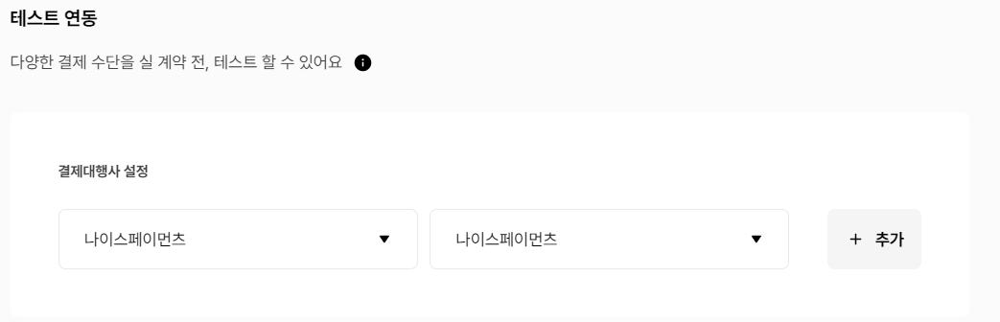
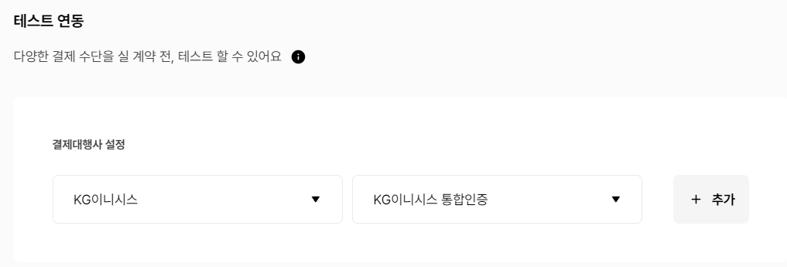

# 2. 프로젝트에서 사용하는 외부 서비스 정보를 정리한 문서

### : 소셜 인증, 포톤 클라우드, 코드 컴파일 들에 활용 된 '외부 서비스' 가입 및 활용에 필요한 정보


### 1. iamport 회원가입


### 2. 결제연동 - 테스트 연동 설정 - 아래 사진 처럼 추가






### 3. 마이페이지 - 내 계정 관리 - 내 식별 코드 API Keys 에서

### 가맹점 식별코드

### REST API Key

### REST API Secret  확인


### 4. frontend 폴터 최상단에서 .env파일 생성


### 5. 파일 내부에 아래와 같이 작성

```
VUE_APP_IAMPORT_API_ID={가맹점식별코드}

VUE_APP_OPENVIDU_PORT={오픈비두포트}
```
